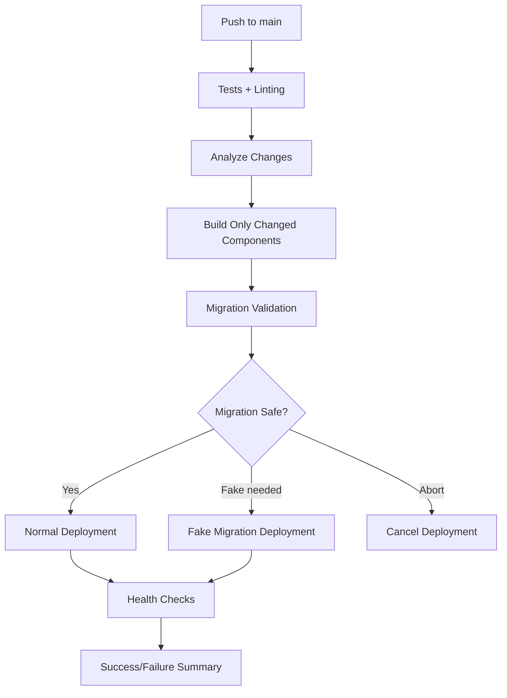

# 🚀 Enterprise Deployment System

## Resumen de Mejoras

Este sistema resuelve los problemas de migración y deployment que hemos enfrentado, implementando un pipeline enterprise-grade con validación, rollback y safety checks.

## 📁 Nueva Estructura de Scripts

```
scripts/
├── smart-deploy.sh        # Deployment principal con validación
├── migration-validator.sh # Pre-validación de migraciones  
├── emergency-cleanup.sh   # Limpieza automática de disco
└── deploy                 # Script master unificado
```

## 🎯 Problema Resuelto

### ANTES:
- ❌ Migraciones fallaban por tablas inexistentes (`cart_item`)
- ❌ `--run-syncdb` destructivo sin validación previa
- ❌ No detección automática de tipos de cambio
- ❌ Scripts dispersos y difíciles de mantener
- ❌ No rollback automático en fallos

### DESPUÉS:
- ✅ **Validación previa** de migraciones en container aislado
- ✅ **Backups automáticos** antes de cualquier cambio destructivo  
- ✅ **Estrategias de migración adaptativas** (normal/fake/abort)
- ✅ **Detection inteligente** de cambios (frontend/backend/infra)
- ✅ **Rollback automático** cuando fallan migraciones
- ✅ **Health checks** de APIs críticos post-deployment

## 🛠️ Uso del Sistema

### Desarrollo Local
```bash
./deploy dev          # Ambiente desarrollo interactivo
./deploy build        # Build y test local
```

### Validación
```bash  
./deploy validate     # Valida migraciones antes de deploy
```

### Producción
```bash
./deploy deploy       # Deployment inteligente y seguro
./deploy emergency    # Deployment de emergencia (sin tests)
```

### Monitoreo
```bash
./deploy status       # Estado del servidor
./deploy logs         # Logs de producción
```

### Mantenimiento
```bash
./deploy cleanup      # Limpieza de emergencia de disco  
./deploy rollback     # Rollback a versión anterior
```

## 🔬 Flujo de Validación de Migraciones

1. **Pre-validación**: Copia BD de prod y testa migraciones en container aislado
2. **Análisis de resultados**: 
   - `normal`: Migraciones funcionan → deployment normal
   - `fake`: Migraciones fallan → usa `--fake` para conflictivas  
   - `abort`: Fallo total → cancela deployment
3. **Backup automático**: Siempre antes de cambios de BD
4. **Rollback**: Si algo falla, restaura backup automáticamente

## 🎯 Beneficios Enterprise

### 🛡️ Seguridad
- Backups automáticos con retención de 10 versiones
- Validación previa evita corruption de BD 
- Rollback automático en fallos

### 🚀 Performance  
- Detection inteligente solo build lo que cambió
- Cleanup automático previene problemas de espacio
- Health checks aseguran APIs funcionando

### 🔧 Mantenibilidad
- Un solo comando `./deploy` para todo
- Scripts modulares y especializados
- Logging detallado para debugging

### 📊 Visibilidad
- GitHub Actions Summary con detalles completos
- Logs estructurados con timestamps
- Status checks automatizados

## 🔄 Workflow GitHub Actions Mejorado



Este sistema garantiza deployments seguros y confiables, eliminando los problemas de migración que hemos experimentado.