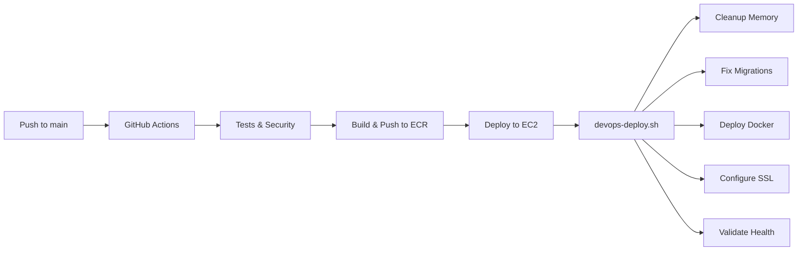

# 🧹 Deployment Cleanup Guide

## Archivos de Deployment Activos (MANTENER)

### ✅ Workflow Principal
- `.github/workflows/devops-deployment.yml` - **USAR ESTE** - Sistema DevOps unificado

### ✅ Scripts Esenciales  
- `scripts/devops-deploy.sh` - Script principal de deployment
- `scripts/fix-ec2-migrations.sh` - Fixes de migraciones para EC2
- `scripts/auto-cleanup.sh` - Limpieza automática de recursos

### ✅ Docker
- `docker/docker-compose.prod.yml` - Configuración de producción
- `docker/nginx/nginx.conf` - Configuración Nginx
- `Dockerfile.prod` - Imagen de producción

## Archivos Obsoletos (ELIMINAR DESPUÉS DE MIGRACIÓN)

### ❌ Workflows Redundantes
- `.github/workflows/deploy.yml` - Legacy, reemplazado por devops-deployment.yml
- `.github/workflows/production-deployment.yml` - Enterprise system, muy complejo
- `.github/workflows/total-rebuild-deployment.yml` - Solo para emergencias

### ❌ Scripts Redundantes
- `scripts/simple-deploy.sh` - Reemplazado por devops-deploy.sh
- `scripts/enterprise-deploy.sh` - Muy complejo, no necesario
- `scripts/production-deploy.sh` - Versión antigua
- `scripts/total-rebuild-deploy.sh` - Solo para reconstrucción total
- `scripts/fix-production-migrations.sh` - Integrado en devops-deploy.sh

## Comandos de Limpieza Recomendados

```bash
# En EC2, después de confirmar que el nuevo sistema funciona:

# 1. Backup de scripts antiguos (por si acaso)
mkdir -p /opt/restaurant-web/backups/old-scripts
mv scripts/simple-deploy.sh scripts/enterprise-deploy.sh scripts/production-deploy.sh /opt/restaurant-web/backups/old-scripts/

# 2. Limpiar imágenes Docker no usadas
docker image prune -af --filter "until=72h"

# 3. Limpiar volúmenes no usados
docker volume prune -f

# 4. Limpiar logs antiguos
find /opt/restaurant-web/logs -type f -name "*.log" -mtime +30 -delete

# 5. Limpiar backups antiguos (mantener últimos 10)
cd /opt/restaurant-web/data/backups && ls -t *.sqlite3 | tail -n +11 | xargs rm -f
```

## Nuevo Flujo de Deployment



## Características del Sistema DevOps Unificado

✅ **Seguridad**
- SSL/HTTPS automático con Let's Encrypt
- AWS Cognito integrado
- Security headers configurados
- Firewall validation

✅ **Optimización**
- Limpieza automática de memoria cuando > 90%
- Limpieza de disco cuando > 85%
- Docker cache optimization
- Resource limits configurados

✅ **Confiabilidad**
- Rollback automático si falla validación
- Backups antes de cada deployment
- Health checks comprehensivos
- Logging detallado con audit trail

✅ **Simplicidad**
- Un solo workflow principal
- Un solo script de deployment
- Configuración centralizada
- Fácil de mantener

## Uso del Nuevo Sistema

```bash
# Deployment manual desde GitHub Actions
# 1. Ir a Actions > DevOps Production Deployment
# 2. Click "Run workflow"
# 3. Seleccionar acción: deploy/rollback/status/cleanup

# O desde línea de comandos en EC2:
./scripts/devops-deploy.sh $ECR_REGISTRY $ECR_REPOSITORY deploy
```